## 학사정보 시스템
- 학생들의 학사 정보와 성적을 관리, 열람, 출력할 수 있는 웹 기반 시스템 개발
- 사용자의 권환 관리, 데이터베이스 설계, RESTful API 개발, 그리고 웹 프론트엔드 구현 포함

## 요구사항

### 데이터베이스 설계 및 구현 O
- 사용자, 과목, 성적 정보를 저장할 수 있는 데이터베이스 모델 설계
- ORM 구현
- 다음 정보 포함:
    - 사용자: 학번(직번), 역할, 이름, 학과, 입학년도(고용년도), 비밀번호(해시값)
    - 과목: 과목코드, 과목명, 학점(0 ~ 6), 담당교수
    - 성적: 학생, 과목, 학기, 점수(0.0 ~ 4.5), 학점(A+, F)
- 모든 사용자의 비밀번호는 1234로 설정함

### RESTful API 개발 O
- 다음 기능을 제공하는 RESTful API 개발:
    - 사용자 정보 CRUD
    - 과목 정보 CRUD
    - 성적 입력, 수정, 조회
    - 학생별 전체 성적 조회
    - 과목별, 학기별 성적 조회
- API 문서화

### 인증 및 권한 관리 O
- 사용자 역할 구현: 학생, 교수, 관리자
- JWT를 이용한 토큰 기반 인증 시스템 구현:
    - 액세스/리프레스 토큰 분리 구현
    - 토큰 검증 로직 구현
- 역할별 접근 권한 설정:
    - 학생: 자신의 성적만 조회 가능
    - 교수: 담당 과목의 학생 성적 입력 및 수정 가능
    - 관리자: 모든 정보에 대한 접근 및 수정 권한
- 예: 학생 권한을 가진 사용자는 성적 수정 API 접근 차단

### 프론트엔드 개발 X - 완성도가 높지 않아 업로드 제외
- 다음 페이지 포함:
    - 로그인 페이지 
    - 대시보드 (사용자 역할에 따라 다른 내용 표시)
    - 성적 조회 페이지 (학생용)
    - 성적 입력/수정 페이지 (교수 및 관리자용)
    - 과목 추가/수정/삭제 페이지 (교수 및 관리자용)
    - 학생 관리 페이지 (관리자 전용)
- 성적표를 PDF로 출력하는 기능 구현

### 테스트 O
- 주요 기능에 대한 단위 테스트 작성
    - API route 당 2개 이상

## 사전 설정
- MySQL Server 설치
- MySQL Query 입력 탭에서 academic_records.sql 파일 실행

## 프로젝트 구조
```bash
Project
    ├── app                      
    │   ├── routes               
    │   │   ├── auth.py         # 로그인 및 인증 관련 라우트
    │   │   ├── grade.py        # 성적 관련 라우트
    │   │   ├── subject.py      # 과목 정보 CRUD 라우트
    │   │   └── user.py         # 사용자 정보 CRUD 라우트
    │   │
    │   ├── static               # 정적 파일(JS, CSS, 이미지 등) 저장 폴더
    │   │   └── js
    │   │       ├── login.js    # 로그인 처리 관련 JS
    │   │       └── token.js    # JWT 토큰 관리 JS
    │   │
    │   ├── templates           # HTML 템플릿 폴더
    │   │   └── index.html      # 메인 페이지
    │   │
    │   ├── __init__.py         # 플라스크 앱 및 라우터 초기화
    │   ├── config.py           # 설정 파일(DB 연결, JWT 설정 등)
    │   └── models.py           # ORM을 통한 데이터베이스 모델 정의
    │
    ├── images_for_README       # README에서 사용하는 이미지 저장 폴더
    │
    ├── tests                   # 기능별 단위 테스트 폴더
    │   └── auth_test.py        # 로그인 및 인증 관련 테스트
    │   └── grade_test.py       # 성적 관련 테스트
    │   └── subject_test.py     # 과목 정보 CRUD 테스트
    │   └── user_test.py        # 사용자 정보 CRUD 테스트
    │
    ├── .env                    # 환경변수 파일(DB 접속 정보, 비밀키 등)
    │
    ├── academic_records.sql    # 데이터베이스 초기화 SQL 파일
    │
    ├── README.md               # 프로젝트 설명서
    │
    ├── requirements.txt        # 의존성 패키지 목록
    │
    └── run.py                  # 애플리케이션 실행 파일
```

## 실행 방법
1. 가상환경 생성
    ```bash
    python -m venv venv
    ```
2. 가상환경 활성화
    ```bash
    venv\Scripts\activate
    ```
3. 의존성 설치
    ```bash
    pip install -r requirements.txt
    ```
4. 웹 시스템 실행
    ```bash
    python run.py
    ```
브라우저에서 http://localhost:5000으로 접속하여 시스템을 확인할 수 있다.

## 결과 분석 (Swagger UI)
1. 사용자 인증 관련 작업
- 로그인 시도 화면
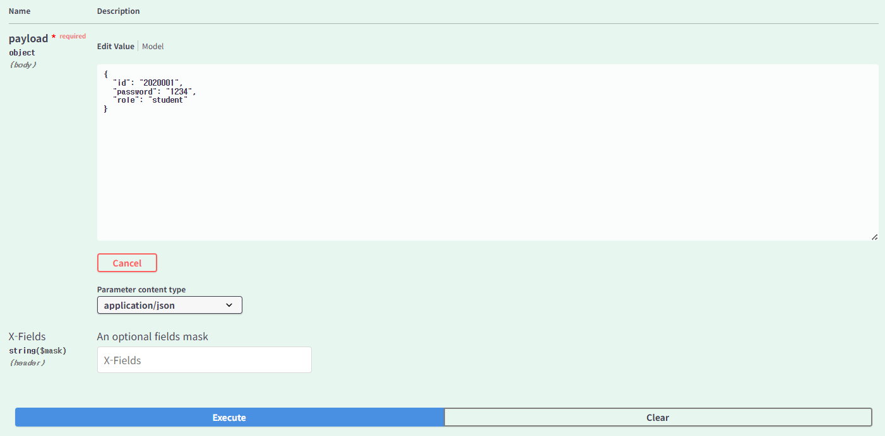

- 로그인 성공 화면
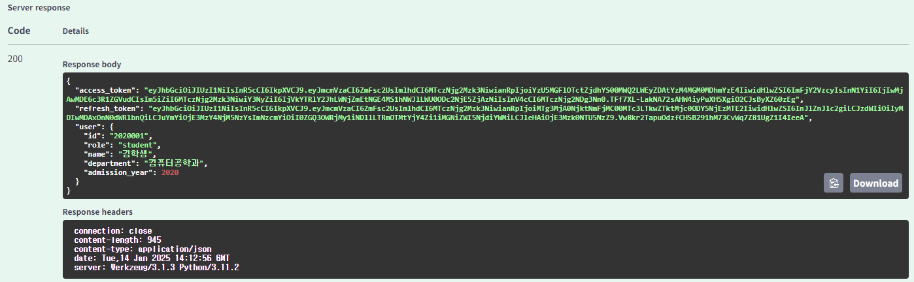 
사용자의 정보와 access token, refresh token 이 잘 응답된 것을 볼 수 있다.

- 로그인 실패 화면 (예: 비밀번호 오류)
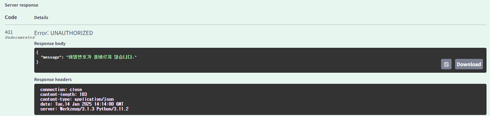

2. access token 재발급 시   
(access token 만료 시 refresh token이 유효하다면 access token을 재발급 할 때 사용)
- Authorize 버튼을 클릭 후 발급 받은 refresh token으로 인증한다.
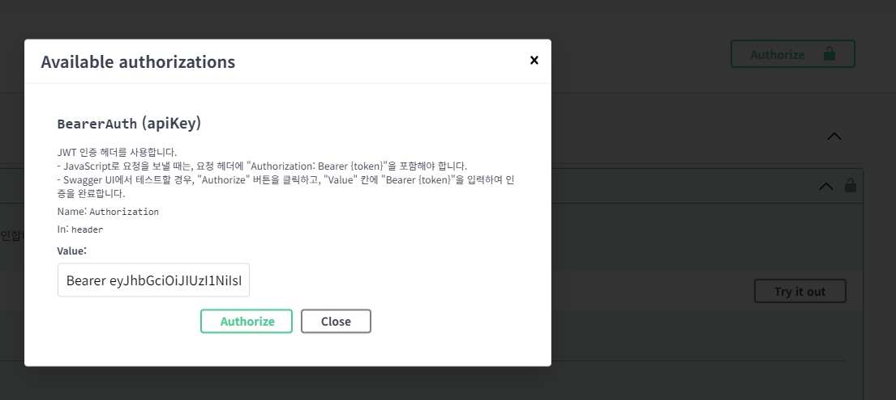

- access token 갱신을 실행한다.
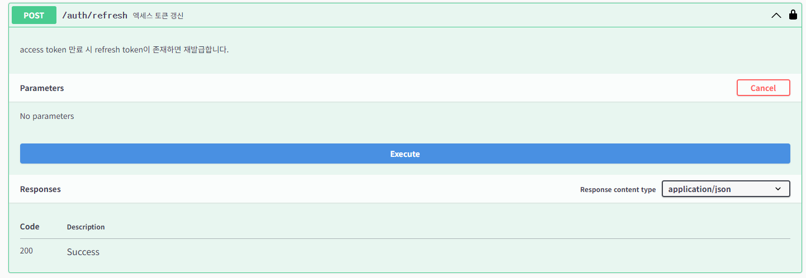

- 성공적으로 재발급 되는 것을 확인할 수 있다. 
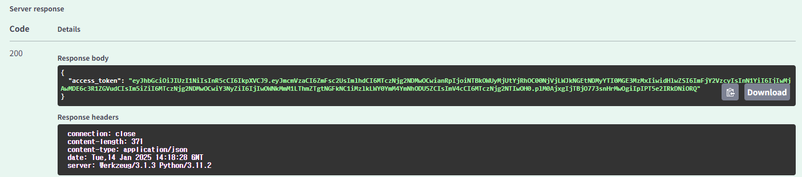

3. 사용자 정보 CRUD  
(관리자만 권한이 부여되므로 관리자로 로그인)

- 모든 사용자 조회  
관리자로 로그인 후 access token 인증 후 모든 사용자 조회가 가능하다. 


- 신규 사용자 생성
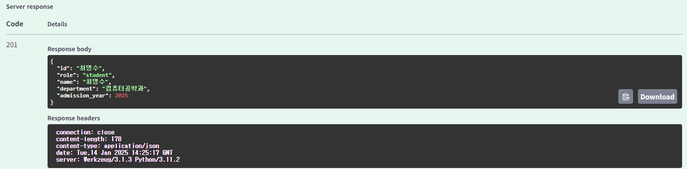

- 특정 사용자 조회  
조회할 사용자의 학번(직번)을 Parameters에 입력한 후 실행한다.
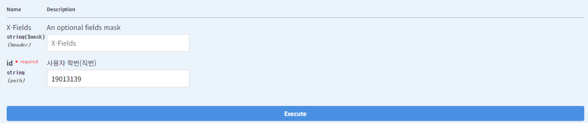

    해당 사용자의 정보가 출력되는 것을 확인할 수 있다.
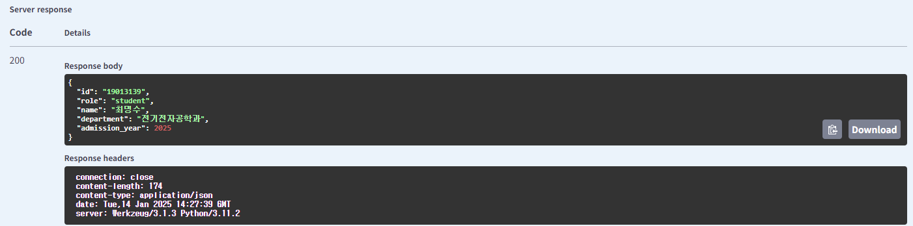

- 특정 사용자 정보 수정  
Parameters에 해당 사용자의 학번(직번)을 입력한 후, 원하는 정보를 수정한다.
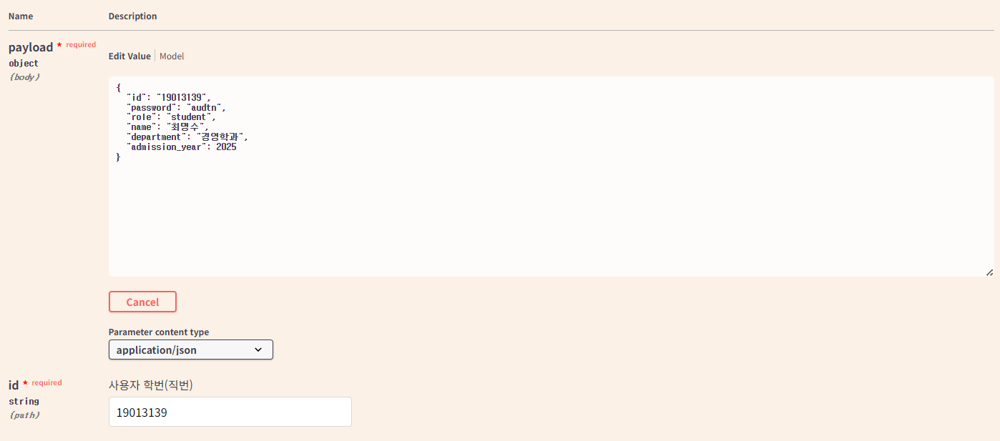

    해당 사용자의 정보가 수정된 것을 확인할 수 있다.
    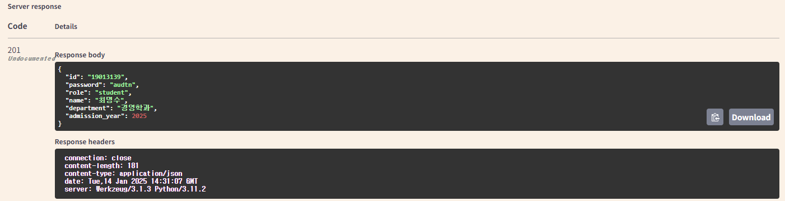

- 특정 사용자 삭제  
Parameters에 삭제할 사용자의 학번(직번)을 입력한 후 실행한다.


    해당 사용자의 정보가 삭제된 것을 확인할 수 있다.
    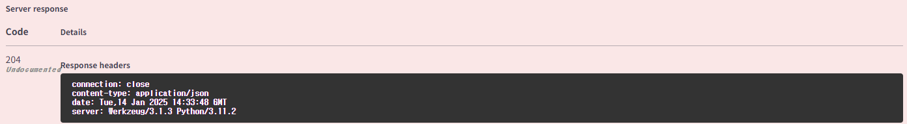

4. 과목 정보 CRUD  
사용자 정보 CRUD와 마찬가지로 실행하면 확인 가능하다.

5. 성적 관련 작업
- 학생별 성적 조회  
Parameters에 원하는 학생의 학번을 입력한 후 실행한다.
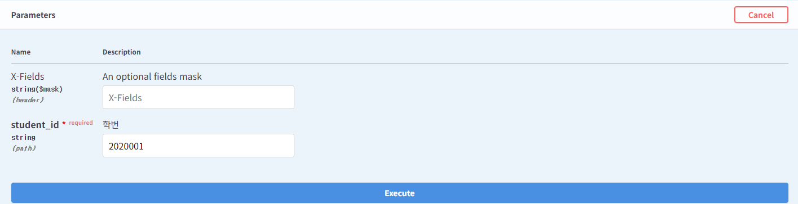

    해당 학생의 성적이 모두 출력되는 것을 확인할 수 있다.
    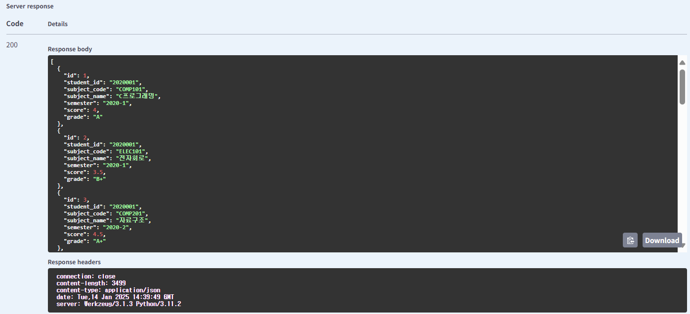

- 과목별 성적 조회
Parameters에 원하는 과목의 이름을 입력한 후 실행한다.
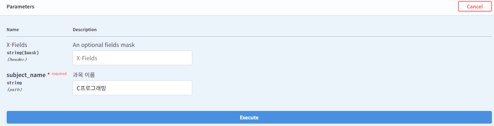

    관리자로 로그인 되어 있기 때문에 모든 성적 데이터가 출력된다.
    

- 학기별 성적 조회
Parameters에 원하는 학기를 입력한 후 실행한다.
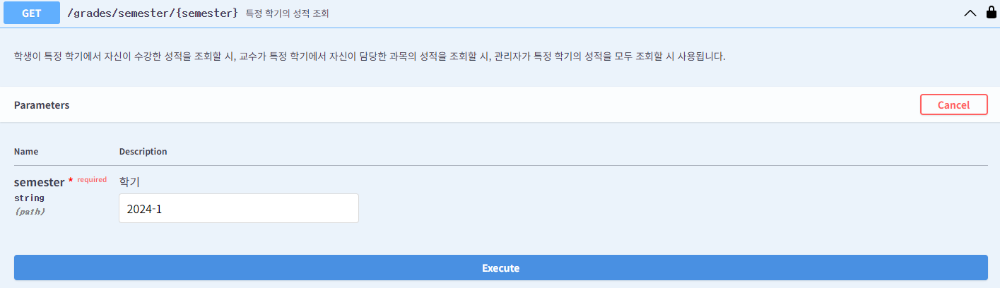

    관리자로 로그인 되어 있기 때문에 모든 성적 데이터가 출력된다.
    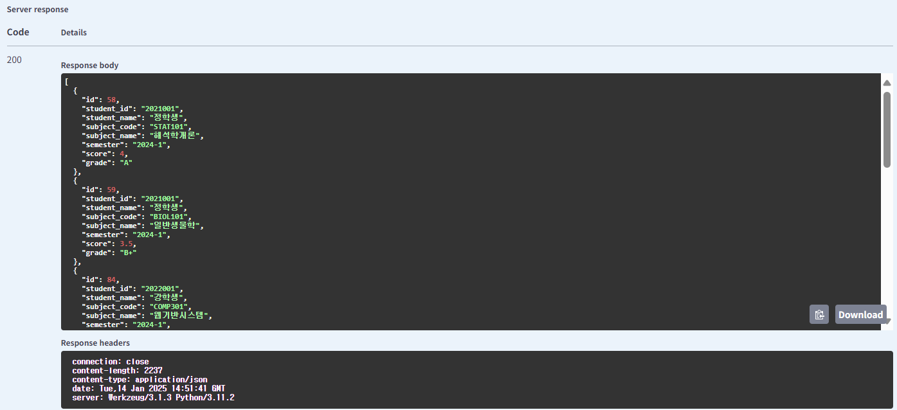

- 성적 입력  
이미 존재하는 성적일 경우 입력이 되지 않는다. 이는 성적 수정의 기능을 활용한다.
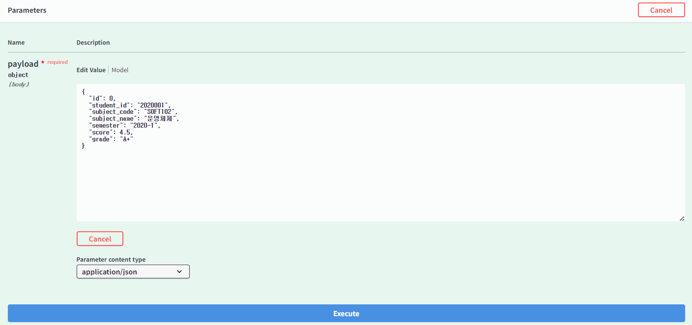

    성적이 잘 입력된 것을 확인할 수 있다.
    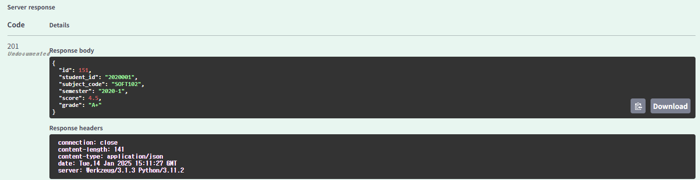

- 성적 수정  
수정할 성적의 과목 코드, 학기, 학생ID를 Parameters에 입력 후, score와 grade를 수정한다.
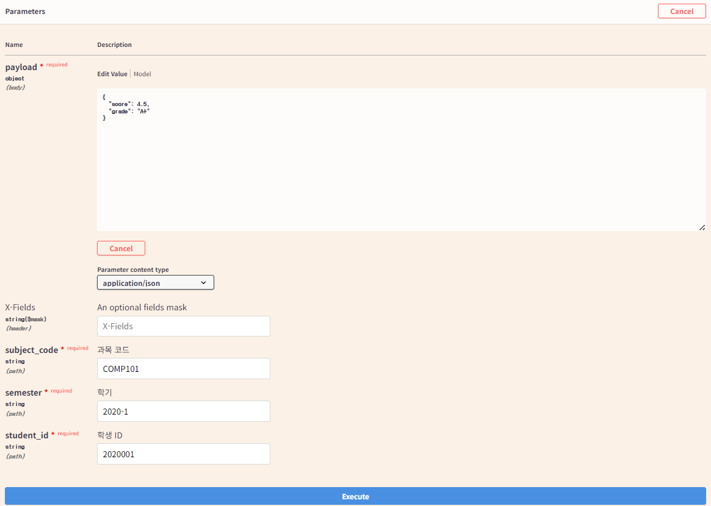

    해당 성적이 수정된 것을 확인할 수 있다.
    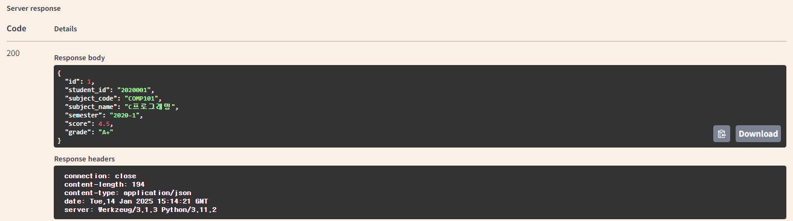

## 테스트
```bash
예: python tests/auth.py
```
```bash
..
----------------------------------------------------------------------
Ran 4 tests in 0.178s

OK
```
    위와 같은 결과 나오면 테스트를 시도한 입력 값에 대해 예상한 결과가 나와 '테스트 성공'을 의미한다.